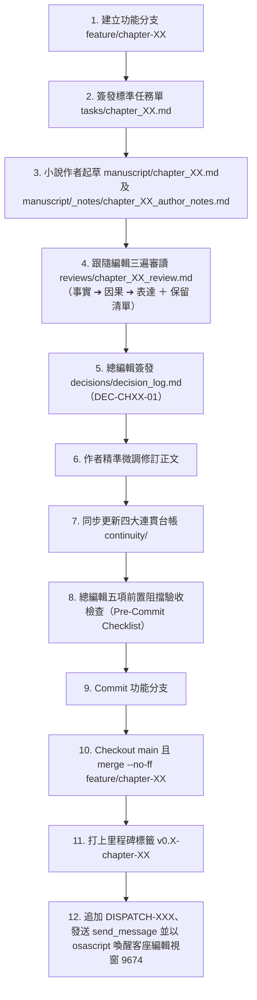

# 《至斬而止》交接與自主執行手冊（HANDOFF.md）

> **建立時間**：2026-10-02 23:58  
> **當前版本基準**：Git commit `cc97fdf` / 定稿標籤 [`v0.7-chapter-05`](file:///Users/appgongyong/至斬而止/)  
> **工作目錄**：`/Users/appgongyong/至斬而止`  
> **適用模式**：自主授權執行模式（Autonomous Execution Mode）。新 Session 啟動後，依據本手冊以全自主工作流推進章節創作、審稿、裁決、台帳同步與版本合併，無需就每個微小動作反覆中斷請示人類使用者。

---

## 一、項目概覽與創作核心綱領

### 1. 作品基本資訊
- **書名**：《至斬而止》（The Slash Stops Here）
- **篇幅定位**：歷史司法中篇小說（預計九章，45,000 ～ 55,000 字）。
- **時代背景**：清光緒三十一年春至夏（西元1905年4月至6月），慈禧太后與光緒帝頒布上諭廢除凌遲、梟首、戮屍與緣坐之際。
- **全書核心主題句（Logline）**：
  > 「一紙廢除凌遲與緣坐的聖旨，保住了一個殺人兇手的完整皮囊；卻救不回兩個月前已依舊法賣入深淵的九歲女兒。」
- **核心哲學命題**：
  *制度改了，為什麼事情仍然辦不完？*（晚清司法體制下的基層版《切爾諾貝利》與《大明王朝1566》風格）。阻力不應只是單純的貪官奸商，更來自於依法辦完、沒有權限、不願重新承擔已結舊案責任的正常官僚。

### 2. 核心人物譜系與知情限制
- **陸雲程**（第一視角核心主角）：翰林編修出身、刑部直隸清吏司六品主事。具有儒家恤刑理想，但在覆核改簽過程中私撕公卷李茂浮簽存根，被老經承胡文煥握住把柄，自毀程序正義，承受體制窒息反噬。
- **沈家本**（政治導師與遠景背景）：刑部右侍郎、修訂法律大臣。推動新法出閣，代表宏大敘事頂層，與基層微觀血肉形成巨大落差。
- **常六**（刑獄地頭蛇）：刑部提牢司獄當差二十五年的老吏（南監差撥）。熟諳九城獄底黑白潛規則，為牟取死囚全屍轉賣利益，與趙連城達成私下肉身抵押協議，成為全案微觀追查的地下推手。
- **趙連城**（死囚）：直隸薊州農民，因被逼迫而殺死崔家三人。滿身煞氣凶徒，對殺人無悔，唯一軟肋為九歲女兒喜兒。
- **胡文煥**（體制官僚黑洞）：直隸司四十年老經承。以「老黑老鼠、蠹魚咬嚙」為由無聲勒索陸雲程，維護衙門無事太平。
- **李茂**（薊州解差）：快班差役，私分三十兩現銀、私鬻幼女入私牙、搜刮魏氏咬痕銀簪。第四章已被常六徹底震懾封口。

### 3. 核心法理與物證鐵律
- **法定刑名**：《大清律例·謀殺人》正律為「殺一家三人者凌遲處死，財產斷付被殺之家，妻子流二千里」。**絕非法定給配苦主為奴**！
- **地方舞弊機制**：薊州官府私分扣留起獲之三十兩現銀，崔家嫌晦氣退回母女並私付封口費，州署為抹平帳目與免去解送驛資，私賣幼女，於招冊刮去字跡、生礬水覆面偽造「給配苦主完結」之賊光。
- **新政引爆點**：光緒三十一年三月二十日上諭下達廢除緣坐，刑部令直隸司開具「免流回籍勘合」發還原籍，陸雲程調卷覆核，失蹤黑幕方才暴露。
- **死刑倒計時錨定**：處決日死死鎖定為**光緒三十一年五月二十二日（西元1905年6月24日，夏至）**。菜市口一刀斬決，「至斬而止」。

---

## 二、當前版本與全書進度

### 1. Git 狀態
- **當前分支**：`main`（乾淨無未提交變更）
- **最新 Commit**：`cc97fdf` (`docs(dispatch): append DISPATCH-009 recording Chapter 5 completion and milestone v0.7-chapter-05`)
- **最新標籤**：`v0.7-chapter-05`

### 2. 全書九章推進全景圖

| 章次 | 章名 | 文本時間 | 距處決日 | 核心事件與線索推進 | 狀態 | 定稿標籤 |
|---|---|---|---:|---|---|---|
| 第一章 | 《硃批出閣》 | 光緒三十一年三月二十日 | **63 天** | 沈家本新折獲硃批；陸雲程深夜受教；新政全面啟動。 | **已定稿** | `v0.5-restructured-ch01-03` |
| 第二章 | 《黑老鴰窩》 | 光緒三十一年四月十六日（春雨夜） | **36 天** | 提牢廳南監接獲預核單；常六透漏免剮改斬；趙連城以身抵押求探喜兒。 | **已定稿** | `v0.5-restructured-ch01-03` |
| 第三章 | 《招冊刮補》 | 光緒三十一年四月廿四日（午後至暮） | **28 天** | 陸雲程抓出刮補賊光與無崔家收照（【線索一】）；撕存李茂浮簽被胡文煥目睹；硃筆改擬斬立決。 | **已定稿** | `v0.5-restructured-ch01-03` |
| 第四章 | 《客棧暗風》 | 光緒三十一年四月廿六日（午後） | **26 天** | 常六在悅來老棧堵截李茂（【線索二】）；查明三十兩私分、魏氏通州病歿、喜兒賣入私牙；起獲【TH-05 咬痕斷頭銀簪】；胡文煥「蠹魚」勒索陸雲程。 | **已定稿** | `v0.6-chapter-04` |
| 第五章 | 《茶肆暗盟》 | 光緒三十一年五月初二日（午後至夜） | **20 天** | 陸雲程行文遭侍郎如英摔文痛斥，體制大門封死；宣武門外南下窪破茶棚密會常六，接獲【TH-05 銀簪】，達成五十兩私銀與夜探暗盟。 | **已定稿** | `v0.7-chapter-05` |
| **第六章** | **《暗牢過堂》**<br>（或《提牢暗驗》） | **光緒三十一年五月初八日** | **14 天** | **常六受賄私帶陸雲程夜入南監；陸雲程首會死囚趙連城；直面滿身血仇之凶徒與沉重父愛。** | ⏳ **即刻起草** | 待簽發 CH06-T01 |
| 第七章 | 《黑市摸排》 | 光緒三十一年五月十四日 | **8 天** | 陸出資、常帶路，微服摸排天橋私牙「花斑豹」；自暗帳查出喜兒轉賣至良鄉旗人王府莊田為奴（【線索三】）。 | ⏳ 待排期 | - |
| 第八章 | 《隔絕之信》 | 光緒三十一年五月廿一日（行刑前夕） | **1 天** | 菜市口黃沙鋪設；深夜常六將斷頭咬痕銀簪交給趙連城；告知喜兒存活但身在莊田永難脫身（【線索四】）。 | ⏳ 待排期 | - |
| 第九章 | 《至斬而止》 | 光緒三十一年五月二十二日（午時三刻） | **0 天（行刑日）** | 宣武門外菜市口第一起免剮改斬刑場；趙連城手握咬痕銀簪伏誅受戮；新律閃耀，草民無聲乾涸。全書終局。 | ⏳ 待排期 | - |

---

## 三、六大協作架構升級規範（已全面實裝）

1. **定向讀取範圍與標準任務資料包（`tasks/`）**：
   - 每次啟動章節必須簽發包含任務編號、正式設定版本、正文基準版本、必讀檔案、允許寫入、本次目標、必須修正（阻擋項）、可自行處理（建議項）、禁止更動（保護項）、完成條件（驗收清單）的標準 Markdown 文件。
2. **總編輯五項前置阻擋驗收清單（Pre-Commit Checklist）**：
   - 每章正式合併至 `main` 前，必須逐一核實五項阻擋條件：
     ```text
     □ 核心行為與司法程序沒有未解的重大矛盾
     □ 人物獲得資訊的途徑成立（無知情躍遷/通靈）
     □ 本章實質改變了事件或人物處境（具備因果推進）
     □ 審稿中的阻擋項已修復或經總編輯明確裁決
     □ 正式設定（canon/）與連貫紀錄（continuity/）已完全同步
     ```
3. **作者場景五問自查與四項鐵律（`agents/novelist.md`）**：
   - 五問自查：欲求、知情、阻力、行動、處境變化（嚴禁寫入小說正文作為說教判詞）。
   - 四項鐵律：無通靈知情、推理區分三層次、承擔行動代價（撕卷必有反噬）、情緒呼吸起伏（嚴禁每場狂吼流淚）。
4. **獨立筆記庫機制（`manuscript/_notes/`）**：
   - 正式正文檔案（`manuscript/chapter_XX.md`）保持絕對純淨，嚴禁章末標註；
   - 待查備忘、偏離說明與修訂對照一律寫入：`manuscript/_notes/chapter_XX_author_notes.md`。
5. **跟隨編輯三遍審讀與保留清單（`reviews/`）**：
   - 第一遍：事實與連貫（姓名、日期、刑名、倒計時天數、知情範圍）；
   - 第二遍：場景與因果（動機、證據、選擇、後果）；
   - 第三遍：表達與文風（修辭降噪、剔除作者說教）；
   - 強制保留 3～5 項「本章最值得保留之處（What to Preserve）」，保護有效文學表達。
6. **四大連貫台帳唯一事實來源（`continuity/`）**：
   - [`timeline_and_deadlines.md`](file:///Users/appgongyong/至斬而止/continuity/timeline_and_deadlines.md)：精確倒計時天數。
   - [`character_knowledge_states.md`](file:///Users/appgongyong/至斬而止/continuity/character_knowledge_states.md)：知情邊界與盲點。
   - [`dockets_and_evidence.md`](file:///Users/appgongyong/至斬而止/continuity/dockets_and_evidence.md)：公卷物證保管與流轉。
   - [`open_threads.md`](file:///Users/appgongyong/至斬而止/continuity/open_threads.md)：全書伏筆進展。

---

## 四、客座編輯（Guest Editor）聯動協議

- **進程狀態**：PID 4257，`ttys003`，常駐運作。
- **對應終端視窗**：**`window id 9674`**（視窗標題包含 `至斬而止 — agy`）。
  > ⚠️ **高危禁令**：絕對不可對 `window id 9587` 執行 AppleScript `do script`，該視窗為人類使用者之主作業視窗！
- **聯動步驟**：
  1. 在 `reviews/guest_editor_dispatch.md` 追加通報條目（如 `DISPATCH-009`）；
  2. 使用 `send_message` 工具向 Recipient `c8c8b315-3eb4-4946-b82e-c95b7db27e2c` 發送 Markdown 摘要；
  3. 執行精確 AppleScript 喚醒客座編輯終端（精確指定 9674）：
     ```bash
     osascript -e '
     tell application "Terminal"
         set w to window id 9674
         do script "echo \"[System Sync: DISPATCH-XXX posted]\"" in w
     end tell
     '
     ```

---

## 五、自主授權模式（Autonomous Mode）標準執行作業流程

新 Session 啟動後，請按照以下十二步標準作業流程，自主推進章節，無需在每個微小步驟向使用者反覆請求確認：



---

## 六、即刻執行任務：第六章《暗牢過堂》（CH06-T01）

### 1. 任務基本參數
- **任務編號**：`CH06-T01`
- **正式設定版本**：`canon-v0.5`
- **基準 Commit**：`cc97fdf`
- **時間點**：**光緒三十一年五月初八日**（夜，亥正一刻至子時）
- **距處決日倒計時**：**整整剩餘 14 天**（五月廿二日處決）

### 2. 核心場景與情節設計
- **場景一（夜入黑老鴰窩 / 體制重罪冒險）**：
  * **地點**：刑部提牢廳西側角門、南監死牢暗道。
  * **人物**：陸雲程（換著皂布快班號衣）、常六。
  * **衝突與氛圍**：
    - 依《大清律例·斷獄》，官員非奉批票私入牢獄「杖八十、徒二年」。陸雲程冒著革職問罪之奇險，換上粗布差役號衣，在夜色中摸入提牢廳。
    - 提牢廳底層老胥役趁著初八換防、更更換牌的空檔，收取陸雲程的打點銀子，對這位堂堂六品主事視若無睹、麻木放行。
    - 描寫南監深處「黑老鴰窩」之窒息恐怖：地牢深陷地下，常年無光，潮氣如腐屍，死鐐拖曳之聲、瘋囚嘶嚎、鼠齧稻草之聲。
- **場景二（初會死囚趙連城 / 血仇與良知的劇烈撞擊）**：
  * **地點**：提牢廳南監最深處甲字號死囚重牢（死刑犯囚室）。
  * **人物**：陸雲程、趙連城、常六（在牢門外持油燈放哨）。
  * **交鋒與核心戲劇動作**：
    - 陸雲程隔著木柵或石門，第一次親眼看見這個殺死崔家三人的重犯。趙連城滿身血泥疥癬、戴著三十斤重死鐐，煞氣逼人，對殺人血仇毫無悔意，卻在聽聞朝廷「廢除緣坐」時發出狼一般的嘶吼，苦苦哀求追問喜兒下落。
    - 陸雲程親身感受體制與人性的巨大撕裂：朝廷法度判定此人罪無可赦、應當凌遲處死；新法保住了他的全屍；而這凶徒心中最柔軟的骨血，已被地方官府與人販黑網撕扯殆盡。
    - 陸雲程懷中藏著【TH-05 斷頭咬痕銀簪】與李茂供述（魏氏暴斃道旁、喜兒賣入旗莊）。面對即將被處決的死囚，陸雲程是否該說出妻子慘死的真相？是否該出示這枚沾滿劇痛齒印的銀簪？陸雲程在崩潰與克制之間做出了艱難的抉擇。
    - 陸雲程向趙連城許諾：在行刑之前，必盡全力查明喜兒下落，哪怕救不出人，也絕不讓她死在黑莊田裡。趙連城跪地叩首，死鐐撞擊石地發出轟響。

### 3. 知情邊界與鐵律自查
- 趙連城此時仍不知道魏氏已死，只知喜兒下落尚在摸排中；
- 陸雲程強忍悲痛隱瞞魏氏暴斃細節，避免趙連城在行刑前十四天於獄中自戕或發狂破壞大局；
- 常六在牢外把風，確認陸雲程與趙連城達成心理契約，確保自己的「皮囊轉賣」不受阻礙；
- 嚴格遵守克制冷峻白描，零作者全知說教判詞。

---
*本手冊已妥善保存於 `/Users/appgongyong/至斬而止/HANDOFF.md`。重啟 session 後，直接讀取本手冊即可無縫啟動第六章！*
