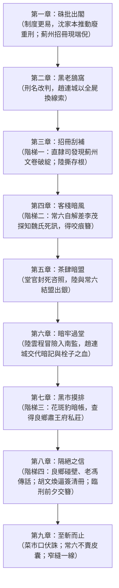

> 2026-10-05 方案 A：家屬處置法理、金流、母死通報與喜兒下落知情，以 `canon/law_revision_20261005.md` 與 `continuity/LAW-20261005.md` 為準。本檔以 zhizhanerzhi v2（2026-10-04）為底稿套用方案 A；凡與之牴觸的舊句不得回灌。

# 《至斬而止》全書大綱（Outline）

> 2026-10-05 版本界線：下文保留舊九章設計史，不再作本輪1–6章逐字寫作依據。現行妻女處置、金流、知情及第7/8章接口以 `canon/law_revision_20261005.md` 和 `continuity/LAW-20261005.md` 為準；「老秦」「二十兩買喜兒」「缺件即證私賣」「妻女同流」「強制免流勘合」等舊設計已被覆蓋。第7–9章未寫，舊日期/程序仍須另校，不視為完成或史料通過。

## 本輪生效章綱差異

- 1：奉旨前陸問家屬處置善後；奉旨後卷面與去向資料不合，尚不知私賣。
- 3：刮補、缺交接材料、李茂浮簽，構成追查理由；不能直接推出母死或莊田所在。
- 4：李茂向常六交代三十兩侵吞、二十兩遣走、十五兩賣女；張家灣私送與母死分節點，得斷簪。日期以現存正文四月廿六為準。
- 5：陸行文受阻後才自常六得死訊、私牙與銀簪；地點仍待追。五月初二。
- 6：五月初八探監，陸隱瞞母死，問三道辨認特徵；趙自辯不推翻父自盡及奪銀設定。無確知良鄉。
- 7/8：留待查私牙帳確認買主與所在，臨刑前傳信交簪。終局方向保留。

## 舊版章綱存檔

- **全書體裁**：歷史司法中篇小說
- **全書章數**：共九章
- **核心創作方針**：
  1. 嚴格貫徹「微觀視角追查」與「結尾走向二（未竟之痛，兩者交會）」。
  2. 喜兒下落嚴格保持開放線索，不預設已知；依四階梯線索逐步摸排，至終局僅得一道窄縫（「我爹會打鐵」），生死與能否贖出仍未解。
  3. 保留 UNRES-01 與 UNRES-02 為待查項，並在各章明確標記小說情節假設，絕不將未查明之制度推論寫為史實。
  4. 天氣全程乾旱（四月十六日僅一場不成氣候的細雨，五月初二、初八悶熱沙塵，五月廿一日「入夏以來沒落過透雨」）。
  5. 稱謂與用字：「嗻」、「卷宗」；行刑統一「鬼頭刀」；「張香濤」「袁慰亭」不加括注；京中首批依新章改擬斬決者，一律稱「新旨頒行後京中頭一批」，不用「第一起」。

---

## 各章詳細大綱架構

---

### 第一章：硃批出閣
- **時間**：光緒三十一年三月二十日（子夜至午後）。
- **場景**：宣武門外後孫公園修律館簽押房；東華門外御道與內閣傳抄處；宣武門內後莊底胡同刑部直隸司公事房及檔案架房。
- **人物**：沈家本、陸雲程、內閣值日學士與掌印中書、直隸司掌印郎中王憲臣、老經承胡文煥。
- **核心事件**：
  1. 子夜，沈家本校畢《刪除律例內重法折》底稿，陸雲程呈報直隸司現押重囚九人（謀害尊長四、殺一家三人以上三、強盜拒捕殺差二），引出薊州趙連城案：招冊明載連斃崔之彥、崔之遠、崔鳳山並僱工栓子，共四命，擬凌遲。王憲臣質疑「趙連城斃崔氏四命僅伏一刀，遺族如何心服」。
  2. 沈家本問僱工栓子年歲，卷內只注「小廝」，年歲未載（伏筆）。
  3. 陸雲程另呈便簽：趙連城擬凌遲，妻女卷上列著緣坐發落，末了卻只寫「交割完結」；若緣坐廢除，部裡問起已辦舊案，她們交給了誰、如今身在何處，朝廷如何答覆。沈家本取「先立大端」：折內不羅列已結前案的家屬去向，待奉旨後部裡再查。
  4. 三月二十日清晨折呈軍機處，巳牌硃批抄發：死刑至斬決而止，凌遲、梟首、戮屍永遠刪除，刺字與緣坐亦即行廢除；緣坐「除知情者仍治罪外，餘著悉予寬免」。（詔文節錄自原詔。）
  5. 午後未時，直隸司接邸抄。王憲臣下令起下舊浮簽、換「擬斬立決」浮簽；胡文煥薦陸雲程掌筆核勘。陸雲程入架房取薊州卷宗，見末頁添注，墨滴落在趙連城名旁。
- **欲望與阻力**：沈家本以大局為重推動改革；陸雲程在清流理想與體制避責慣性之間戰兢辦差。
- **伏筆**：栓子年歲未載；添注與正律牴觸；胡文煥主動薦陸掌筆。

---

### 第二章：黑老鴰窩
- **時間**：光緒三十一年四月十六日，夜（傍晚僅飄一陣細雨，只壓下浮土）。
- **場景**：刑部提牢廳南監（「黑老鴰窩」）甲字七號；常六提牢廳旁小屋。
- **人物**：常六（四十五歲，南監差撥，當差二十五年，承襲亡父差役）、趙連城、小禁卒麻子。
- **核心事件**：麻子遞來提牢主事房私下抄轉的預核排單（無紅印，焦炭條折印），「薊州趙連城」名下草批「風聞擬斬，候直隸司正式翻簽。預排五月廿二」。常六算定三十六天。他向趙連城透露免剮改斬、留全屍、緣坐廢除，並說薊州開春已把魏氏母女「給配完結」，另有薊州差役在騾馬市客棧酒後漏嘴，稱母女沒進崔家的門、路上就散了，是死是賣不明。趙連城（關押近四個月）以死後全屍作押，求常六向薊州進京解差打聽九歲女兒喜兒的死活。常六應下，條件是屆時伸直脖子。常六回小屋，想起八十二歲老母每月初一收二兩銀，仍在數「三十六」。
- **致命倒計時（Ticking Clock 啟動）**：錨定處決日為五月二十二日，**「距離菜市口伏誅尚餘三十六天」**。
- **史實邊界與情節假設標記**：
  * *史實依據*：清代刑部南監惡劣環境、連環鐐制度（《燕京雜記》）。
  * *小說情節假設*：四月中旬提牢廳內部預行通報時點（UNRES-01 假設）。

---

### 第三章：招冊刮補（線索階梯一 ＋ 存根之罪）
- **時間**：光緒三十一年四月廿四日（午後至黃昏）。
- **場景**：刑部直隸司公事房（後窗對西側古槐）。
- **人物**：陸雲程、老經承胡文煥（在直隸司三十年）、常六（上堂繳南監浮牌）。
- **核心事件**：
  1. **剖卷（階梯一）**：薊州招冊二月初十進部。陸雲程反覆驗卷，發現末頁「家屬給配苦主，辦竣結案」字樣被薄刃削去表層纖維、敷生礬水，光下泛出死白；卷內無崔氏收照、無驛站遞解憑單、無苦主指印。胡文煥辯稱州署以人口抵付燒埋銀，是州縣常有的挪移，並搬出知州乃侍郎如英同榜門生、崔家連著旗人莊田。
  2. **常六上堂**：繳紅頭黑漆浮牌，瞥見案頭招冊與刮字小刀；陸雲程問趙連城「若有牽掛，可曾向你提過什麼」，常六以市井傳聞試探，保證二十八天內人在南監出不了岔子。
  3. **撕存根**：常六退下後，陸雲程自招冊騎縫撕下「解役過境浮簽存根」（下角鐵印「薊州快班差役·李茂」），藏入袖筒；胡文煥目睹。陸雲程隨即硃筆改擬「斬立決」，令胡文煥呈堂官畫押，次日卯正三刻進宮。
- **致命倒計時**：**「距離菜市口伏誅尚餘二十八天」**（章末以袖中紙條收束，不重述倒計時）。
- **欲望與阻力**：陸雲程追查新法要求釋放卻在體制中失蹤的家屬；胡文煥為自保極力壓制。

---

### 第四章：客棧暗風（線索階梯二）
- **時間**：光緒三十一年四月廿五日清晨；四月廿六日午後至黃昏。
- **場景**：提牢廳西廊；宣武門外騾馬市大街悅來老棧西角耳房；直隸司公事房。
- **人物**：常六、胡文煥、薊州快班差役李茂、陸雲程。
- **核心事件**：
  1. 四月廿五日卯初，胡文煥在提牢廳西廊向常六「打招呼」（提醒月初規費照舊，借機透出陸主事驗卷、撕存根之事，要常六把趙連城看緊），等於把陸雲程的把柄遞到常六手上。同日卯正三刻堂官捧名冊（連同重造的九名改擬重犯）進大內。
  2. 四月廿六日，常六在悅來老棧堵住李茂，以陸主事的存根相脅，逼出實情：趙連城於臘月初三案發後在通州渡口落網，起獲三十兩被房吏與快班頭兒私分，招冊虛添「斷付崔家，充燒埋之資」；崔家嫌少，族裡起先吵著要人；正月開春，州署房司照「給配崔家」的卷面派差，快班押魏氏與九歲喜兒往崔家莊，崔管事不讓進門，甩二十兩，說人不要、帶遠些；快班不敢押回州署，轉往張家灣等牙子；行至通州張家灣，魏氏染痢疾，正月廿八夜死在客棧後頭漏雨草棚，草席裹埋於官道西三里亂葬崗，插一根柳枝；魏氏臨死叫「喜兒」又疑叫「連城」，並自拔頭上銀簪咬住，簪頭咬斷。次日（正月廿九）私牙「花斑豹」以十五兩買走喜兒，裝青菜騾車入關，說是京南旗人大莊頭要這類孩子，帳上有記。李茂交出自魏氏口中拔出的咬痕斷頭簪。常六放李茂連夜回薊州。
  3. 同日傍晚，直隸司公事房：硃批發下，本批勾決四名，趙連城居首，五月二十二日菜市口。胡文煥指少了一角浮簽，提出造《卷庫蛀蝕修補清冊》，以「蠹魚咬嚙」遮掩；陸雲程默許「經承辦理便是」，將存根折小塞進靴筒。
- **致命倒計時**：**「距離菜市口伏誅尚餘二十六天」**。
- **線索推進**：**【線索階梯二達成】**。魏氏死訊、喜兒活著被賣入京南旗莊、咬痕簪起獲。

---

### 第五章：茶肆暗盟
- **時間**：光緒三十一年五月初二（午後至夜）；五月初三酉正。
- **場景**：刑部大堂東夾道值房；東暖閣簽押房；後孫公園書齋簾外；琉璃廠山西通泰銀號；南下窪爛縵胡同口茶棚；菜市口西鶴年堂藥鋪。
- **人物**：陸雲程、王憲臣、刑部滿洲侍郎如英、胡文煥、沈家本（簾後）、麻子、常六。
- **核心事件**：
  1. 陸雲程寫四稿《直隸清吏司請飭查核薊州重案家屬去向咨照》。王憲臣壓不住；如英在東暖閣摜碎咨照，斥「嗣後」二字、拿朝中彈劾沈家本相脅，令燒毀，並警告誰再就趙家家眷走漏半字即革職鎖南監。胡文煥立於廊柱陰影，無言換手拂子。
  2. 沈家本簾後只言「如英的人先你一步來過」，問「那孩子多大了」，答「九歲」，隨即道「回去吧」。
  3. 麻子遞荷葉約見。陸雲程至通泰銀號問押考績折銀（三十兩）與祿米票（約十五兩）共四十五兩，次日辦理。
  4. 茶棚中常六剖白動機（買趙連城的皮囊，不是行善），轉述李茂三件事（魏氏正月廿八死張家灣，喜兒正月廿九賣花斑豹作價十五兩，被私牙帶進京南），交出咬痕簪。陸雲程出四十五兩：十兩會票加一錠五兩雪花銀共十五兩交常六先打點，二十兩自留用在刀刃上，另十兩留往後走動。陸提出條件必須親見趙連城（認喜兒須問記號），約五月初八換防夜入南監。
  5. 五月初三酉正，陸雲程把裝銀的粗陶茶葉罐放進鶴年堂後櫃第七格（「地骨皮」）；旱煙漢子（常六）持半截火鐮取走。
- **欲望與阻力**：陸雲程試圖依託公文權力追查；制度官僚以「嗣後」為由封死官方路徑，迫使他轉入體制外。

---

### 第六章：暗牢過堂
- **時間**：光緒三十一年五月初八，夜（亥正一刻入，子正二刻出）；至黎明。
- **場景**：南下窪破馬棚；刑部大堂西側夾道角門；南監三十六級石階、甲字七號牢房；空牢；陸雲程寓所。
- **人物**：陸雲程、常六、趙連城、老齊（胡文煥外甥，外班獄卒）、值夜老獄卒。
- **核心事件**：陸雲程換快班號衣（常六託人自病故差役家買得）入南監，初三所交十五兩中的五兩碎官銀已塞給值夜獄卒。陸表明身分並告知簽已改斬立決；他對趙隱瞞魏氏死訊，只說留在通州客店、後事在查，並說喜兒被賣給私牙、帶進了關，往後去向還在查。趙連城交代喜兒三道暗記：左肩胛銅錢大半月青胎記、右耳垂後芝麻小紅痣、六歲時所鍛黑鐵如意長命鎖（紅棉線，鎖底邊角鏨一個「連」字）。陸追問招冊栓子一節，趙吐露從未對人（連常六）說過的實情：崔鳳山帶莊丁砸鋪，三十兩是賣鋪銀；父親被打斷肋骨三日吐血死，知州受崔家銀反打趙四十板；臘月初三夜持剔骨尖刀入崔宅殺崔氏三人，後在門房殺栓子（十四歲，典給崔家抵租子，喊「饒命」，倒在門檻上睜眼看他）。趙問「殺了不該殺的人，是不是不配為閨女求活路」，陸答「我不知道，但我會去找」，許十四天內給回話。歸途遇老齊持燈巡查，常六稱陸為「麻子的表弟」並塞碎銀。章末陸雲程翻副本，看著「並僱工栓子一名」，吹燈。
- **致命倒計時**：**「距離菜市口伏誅尚餘十四天」**。
- **史實邊界與情節假設標記**：
  * *史實依據*：晚清獄卒受賄私帶外部人員入監之弊端（《燕京雜記》，UNRES-03 支撐）。

---

### 第七章：黑市摸排（線索階梯三）
- **時間**：光緒三十一年五月初十夜；五月十二日午後至夜。
- **場景**：椿樹胡同巡街營周書辦宅；南下窪花斑豹的鴉片土屋；良鄉肅王府私莊後院通鋪（章末短場景）。
- **人物**：常六、周書辦、陸雲程（微服）、私牙「花斑豹」及打手、喜兒（大丫）。
- **核心事件**：
  1. 五月初十，常六以十兩向周書辦買下巡街營李管帶收花斑豹四十兩封口銀的條子（上月十五廣安門外截下通州一批生口），說只借來「嚇一個人」。
  2. 五月十二日，二人入南下窪。陸雲程先出聲，以提票相逼，被花斑豹識破虛張（提票需堂官畫押、行文步軍統領衙門）；常六亮出巡街營條子，局面翻轉。陸雲程以山西通泰會票二十兩（即花斑豹正月廿九轉付莊頭的價）買看一頁正月暗帳。帳載：正月廿九薊州李茂轉來通州生口女童一名，充大丫；驗明左胛骨月形青癬、右耳垂後硃砂小紅痣、項帶黑鐵小鎖底鏨連字；同日作價二十兩轉付良鄉縣城西南三十里八旗肅王府私莊莊頭烏勒春，充粗使幼婢。三樣記號與趙連城所述一一吻合。花斑豹憶及孩子上車不哭、死攥鐵鎖、咬傷其手下，說「莊子進不去的」。
  3. 陸雲程決定親赴良鄉，常六須守南監，勸他別空著手。
  4. 章末（讀者專屬）：莊上通鋪，被喚作大丫的女孩被搶去鎖、摔在地上，夜半尋回，用碎瓦割開襖子內襯，把黑鐵鎖縫進去。
- **欲望與阻力**：陸雲程欲查實去向；花斑豹先以虛張識破、再以莊頭干係推諉，最終被條子制住。
- **線索推進**：**【線索階梯三達成】**。查明喜兒（大丫）正月廿九入良鄉肅王府私莊，四個月來生死不明。

---

### 第八章：隔絕之信（線索階梯四）
- **時間**：光緒三十一年五月十三日至五月十八日（良鄉）；五月十九日夜；五月廿一日夜至五月廿二日丑正。
- **場景**：直隸司（請假）；盧溝橋官道、良鄉縣城、肅王府莊外壕溝與柵門；刑部西側角門；南監甲字七號；直隸司公事房；菜市口鋪沙。
- **人物**：陸雲程、王憲臣、莊頭烏勒春、荷鋤老漢、菜車夫老馮、常六、趙連城、胡文煥、如英。
- **核心事件**：
  1. 陸雲程謊稱風寒告假，五月十四日出彰儀門赴良鄉。莊牆兩丈、壕溝、窄木橋、柵門與包鐵角門。烏勒春（四十來歲，面白，盤核桃）拒收兩錠銀，稱王府的人「不賣，不贖」，並威脅。三日守候：荷鋤老漢說莊裡去年秋天抬出一個孩子；陸雲程託五十多歲、姓馮的騾馬市菜車夫老馮，以一兩銀子換他在灶房後問洗菜丫頭「誰的爹會打鐵」，有信到刑部西側角門找常六。家丁最後威脅扔進溝裡。
  2. 五月十八日傍晚，陸雲程回到宣武門外，向角門內等候的常六交代，常六只說「小的記著了」。
  3. 五月十九日夜，常六獨下甲字七號，教趙連城行刑前的要領（脖子別繃、想著打鐵、酒肉照喝），自陳見過約一千一百個，末句「你那皮囊，我還沒想好怎麼處置」。
  4. 五月廿一日夜，如英宣佈御前硃牌已下、明日午時三刻開刀；王憲臣用印封存《處決批條》。胡文煥持《卷庫蛀蝕修補清冊》（郎中已畫押）逼陸雲程補簽，並點出西角門有穿號衣的生臉（老齊的耳目）；陸雲程簽名。
  5. 丑正三分，南監。常六引陸雲程下牢，陸交還咬痕簪，並把魏氏死狀、帳上去向、良鄉碰壁如實相告；趙連城問「她走的時候疼不疼」，叩首謝，答應明日伸頸，不讓皮肉拉爛；說「大老爺，明日您別來」。
- **致命倒計時**：**「距離菜市口伏誅尚餘一天」**。
- **線索推進**：**【線索階梯四達成】**。趙連城知悉魏氏死訊與喜兒去向，但無從知道她現下是否活著；老馮的傳話尚在途中。

---

### 第九章：至斬而止
- **時間**：光緒三十一年五月二十二日，黎明至傍晚。
- **場景**：宣武門外牆根；南監天井；菜市口丁字街；後孫公園書齋；德豐樓二樓；南下窪義莊與義地。
- **人物**：趙連城、常六、陸雲程、王憲臣、如英、沈家本、胡文煥、縫屍匠、麻子。
- **核心事件**：黎明，陸雲程在牆根坐一個時辰，豆漿老頭送他一碗。辰時三刻驗明正身（案由「薊州殺一家四命」），除鐐、灌酒、常六避開頸脈理繩結並說「她是活著進去的」。巳正二刻菜市口圍觀者抱怨「一刀完事沒嚼頭」，公使館馬車與外國人木相機在場；囚車載四名死囚。午時三刻（同一刻），沈家本在後孫公園一滴墨落在「嗣後死刑，至斬決而止，緣坐亦行廢除」一行，另取新紙續抄。午時三刻，王憲臣擲牌，趙連城自己伸頸，刀落；如英令奏稿添「觀者如堵，秩序整肅，各國使館亦無異詞」。常六收屍，不掰他攥著簪子的右手。陸雲程在德豐樓以炭盆焚去李茂存根（因昨夜已簽清冊，存根已不再是證物而是自己的罪證）；樓下胡文煥嗅出燒紙味，提醒清冊明日入庫。傍晚義莊：藥鋪夥計出四十兩買整身，常六喝退；縫屍匠縫頭；薄皮白木棺，趙連城掌心仍攥簪子；光板白木牌背面刻一個「連」字；常六說「今兒破了」「皮囊我收了，沒賣」「往後老爺要翻這筆賬，找小的」。常六轉述老馮：前天進莊，在灶房後問丫頭，最小的那個說「我爹會打鐵」，再問名字就不說了。陸雲程把剩下九兩交常六，約五天後老馮再進莊，常六去騾馬市等。
- **終局定調**：新政律條在公文上實施，一個無名小民的命運只剩一道窄縫；胡文煥手上握著陸雲程簽名的清冊；陸雲程的自保代價與喜兒的生死都留作未竟。

---

## 連貫性與伏筆收束對照表

| 伏筆 | 登場章節 | 推進章節 | 最終收束章節 | 收束結果 |
|---|---|---|---|---|
| 趙魏氏與趙喜兒去向 | 第一章（添注與正律牴觸） | 第二章（傳聞）、第三章（刮補）、第四章（李茂）、第七章（暗帳） | 魏氏：第八章；喜兒：第九章（未竟） | 魏氏正月廿八死於張家灣；喜兒入良鄉肅王府私莊改名大丫，第九章經老馮得「我爹會打鐵」一線，生死與能否贖出未解。 |
| 改刑批文時差與處決日 | 第二章（預排五月廿二） | 第三章（換簽改擬） | 第四章 | 四月廿五日堂官進宮，廿六日硃批：勾決四名，趙連城居首，五月二十二日。 |
| 薊州起獲三十兩銀 | 第一章（招冊「攜銀三十兩」） | 第二章、第四章（李茂：房吏與快班頭兒私分） | 第六章 | 趙連城自述三十兩為賣鋪銀，被崔鳳山以碎銀強買，案發後自帳房取回；被州署上下私分並虛報充燒埋之資。 |
| 刑部守舊勢力反撲 | 第一章（王憲臣） | 第三章（胡文煥）、第五章（如英摜碎咨照） | 第八章 | 官方管道封死；封卷、硃牌下達，「誰再生枝節以違旨論處」。 |
| 咬痕銀簪 | 第四章（李茂交出） | 第五章（轉交陸雲程）、第八章（交還趙連城） | 第九章 | 趙連城攥簪伏誅，簪隨全屍入棺，葬義莊。 |
| 浮簽存根與胡文煥把柄 | 第三章（陸撕存根） | 第四章（蠹魚、清冊）、第八章（簽清冊） | 第九章 | 陸雲程於德豐樓炭盆焚存根；胡文煥嗅出，清冊（有陸簽名）留作其手中新把柄，仍開放。 |
| 常六與趙連城的皮囊之約 | 第二章 | 第五章（剖白動機）、第八章（「還沒想好怎麼處置」） | 第九章 | 常六拒四十兩，不賣皮囊，縫頭薄棺下葬、木牌背刻「連」，並言明往後找他。 |
| 栓子（僱工，十四歲） | 第一章（沈家本問年歲，未載） | 第六章（趙連城自述殺栓子） | 第六章末、第九章（案由「四命」） | 陸雲程以「並僱工栓子一名」收束第六章；趙連城至死不辯。 |
| 喜兒的記號（青胎、紅痣、「連」字鎖） | 第六章 | 第七章（暗帳核對、末尾縫鎖）、第八章（託老馮問「誰的爹會打鐵」） | 第九章 | 「我爹會打鐵」是唯一的人證，不問而驗。 |
