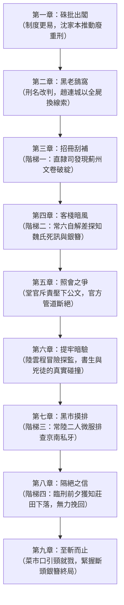

# 《至斬而止》全書大綱（Outline）

- **全書體裁**：歷史司法中篇小說
- **全書章數**：共九章
- **預定總字數**：45,000 ～ 55,000 字
- **核心創作方針**：
  1. 嚴格貫徹「微觀視角追查」與「結尾走向二（未竟之痛，兩者交會）」。
  2. 喜兒下落嚴格保持開放線索，大綱不預設位置已知，依四階梯線索逐步摸排。
  3. 保留 UNRES-01 與 UNRES-02 為待查項，並在各章明確標記小說情節假設，絕不將未查明之制度推論寫為史實。

---

## 各章詳細大綱架構

---

### 第一章：硃批出閣
- **時間**：光緒三十一年三月二十日。
- **場景**：宣武門外後孫公園修律館書齋、內閣大堂、刑部直隸司。
- **人物**：沈家本、陸雲程、內閣值日學士、直隸司王郎中。
- **核心事件**：深夜，沈家本伏案校對《刪除律例內重刑折》底稿，決心廢除凌遲、梟首、戮屍與緣坐。陸雲程提出具體案件困境：舊案中緣坐流徙家屬若已發解，新政如何善後？沈家本指出「大綱若定，細目方能整飭」。同日，奏折遞入宮中，光緒帝硃批降旨：「死刑至斬決而止，凌遲梟首戮屍著即永遠刪除，其刺字及緣坐之法亦即行廢除。……至謀反大逆各罪，犯人知情之父母兄弟妻子，仍照舊例治罪。」刑部各省清吏司奉令起簽換簽、重造斬決名冊。
- **欲望與阻力**：沈家本以大局為重推動改革；陸雲程在清流宏圖與體制避責慣性中戰兢辦差。
- **伏筆**：直隸司死囚名冊中，「直隸薊州民人趙連城」一案被列入換簽改擬之列。

---

### 第二章：黑老鴰窩
- **時間**：光緒三十一年四月十六日（春雨夜）。
- **場景**：北京宣武門內刑部提牢廳南監（死囚地牢「黑老鴰窩」）。
- **人物**：常六（南監差撥，當差二十五年）、趙連城（薊州死囚，腳戴連環大鐐）、值班禁卒。
- **核心事件**：提牢廳接到內部預行編造備辦死囚名冊通知。常六提燈巡監，將外界「皇恩浩蕩、死刑改斬、免緣坐」的風聲透露給趙連城。常六盤算死囚留全屍在菜市口縫屍匠與市井買賣中的好處。趙連城驚聞朝廷廢除緣坐，從求死麻木中被猛然喚醒，出於困獸野獸般的直覺，以「死後皮囊全屍任由常爺處置」為質，求常六打聽九歲女兒喜兒死活。
- **致命倒計時（Ticking Clock 啟動）**：錨定處決日為五月二十二日，**「距離菜市口伏誅尚餘三十六天」**。
- **史實邊界與情節假設標記**：
  * *史實依據*：清代刑部南監惡劣環境、連環鐐制度（《燕京雜記》）。
  * *小說情節假設*：四月中旬提牢廳內部預行通報時點（UNRES-01 假設）。

---

### 第三章：招冊刮補（線索階梯一 ＋ 雙雄提前交鋒）
- **時間**：光緒三十一年四月廿四日（午後至黃昏）。
- **場景**：刑部直隸司值房、二進院迴廊。
- **人物**：陸雲程、常六（受傳喚交回浮簽）、直隸司老經承胡書吏。
- **核心事件**：
  1. **法醫剖卷與線索階梯一**：依新政廢除緣坐條款，陸雲程須核開「免流釋放回籍勘合」。在調閱薊州原卷時，發現案犯妻女本應「流二千里」，但底冊「家屬給配苦主」字跡被刮字薄刃削去三層、生礬水覆面泛出死白「官場賊光」，且整冊卷宗徹底缺漏苦主崔家收領回照！證實母女二人根本未入官驛流配，早被私相變賣（**【線索階梯一達成】**）。
  2. **迴廊交鋒與撕卷代價**：常六受傳喚上堂交牌，蛇眼探卷，以市井暗語試探堂官是否追查規費。常六走後，陸雲程為追查下落，冒險撕下薊州解差「李茂」過境浮簽存根收入袖中；此舉被老經承胡書吏盡收眼底，成為胡書吏暗中掣肘陸雲程的致命把柄！陸雲程隨後硃筆改擬斬決，明晨呈堂面聖。
- **致命倒計時**：**「距離菜市口伏誅尚餘二十八天」**。
- **欲望與阻力**：陸雲程追查新法要求釋放卻在體制中失蹤的家屬；胡書吏為自保極力壓制；官僚體制不願翻開舊案責任。

---

### 第四章：客棧暗風（線索階梯二）
- **時間**：光緒三十一年五月初。
- **場景**：北京宣武門外騾馬市大街「悅來老棧」、清茶館。
- **人物**：常六、薊州解差老秦、小客棧掌櫃。
- **核心事件**：薊州衙門押解新犯抵京，常六在小棧設酒招待同鄉老差役老秦。幾杯老白乾下肚，常六套問趙案家屬。老秦酒後吐漏實情：開春解送魏氏母女時，魏氏在官道小店染上風寒痢疾，不到三天便暴斃道旁草草埋掉；崔家懼怕養虎為患，又嫌九歲的女娃晦氣無用，私下勾結京南人販（私牙）將喜兒抵折了二十兩腳力錢。
- **欲望與阻力**：常六欲坐實線索以便向趙連城交代、鎖定全屍交易；老秦既想貪酒又怕走漏私鬻人丁的罪責。
- **線索推進**：**【線索階梯二達成】**。證實趙魏氏道中病歿；喜兒存活但落入京南私牙網絡。老秦交出一件自魏氏屍身拔下的信物——一枚折斷了簪頭的粗銀簪（[TH-05](file:///Users/appgongyong/至斬而止/continuity/open_threads.md#L7)）。

---

### 第五章：照會之爭
- **時間**：光緒三十一年五月中旬。
- **場景**：刑部堂官簽押房、直隸司公事房。
- **人物**：陸雲程、刑部直隸司郎中、刑部堂官（滿侍郎）。
- **核心事件**：陸雲程難以壓抑心中疑竇，擬就一份《行直隸總督請飭薊州查核緣坐人口銷籍咨照》，呈請郎中轉呈堂官核准發文。堂官閱後勃然大怒，當堂將公文擲地，痛斥陸雲程「借變法生事、苛責地方」。堂官指出：朝廷新詔只令「嗣後廢除」，未曾許諾清查舊案；直隸士紳為廢重刑已多有怨言，若刑部為死囚後人追討苦主家奴，將激起直隸大亂。
- **欲望與阻力**：陸雲程試圖依託官僚體制之公文權力追查人口；制度官僚以「無溯及細則、防微杜漸」為由徹底封死官方路徑。
- **轉折點**：體制大門重重關閉。陸雲程體認到新法只救官員政績、不救具體草民，迫使他轉入非正式管道。

---

### 第六章：提牢暗驗
- **時間**：光緒三十一年五月下旬。
- **場景**：刑部提牢廳重犯監走廊、水牢邊值房。
- **人物**：陸雲程、常六、趙連城。
- **核心事件**：陸雲程持直隸司「查驗待決死囚舊傷」之公文火票，並重銀打點提牢司獄，由常六引路深夜下獄。陸雲程首次見到趙連城。原本心懷儒家哀矜之心的書生，面對的不是無辜的弱者，而是一個滿身煞氣、對手刃崔家三人毫無悔意、只求保全女兒的兇手。趙連城譏諷老爺們「換湯不換藥」；陸雲程則被趙連城身上的血債與野獸般的父愛震懾。
- **欲望與阻力**：陸雲程欲探求案件真相以慰良知；趙連城欲確認來者能否帶來女兒生機；常六在旁冷眼計算兩造利益。
- **史實邊界與情節假設標記**：
  * *史實依據*：晚清獄卒受賄私帶外部官員入監驗視之弊端（《燕京雜記》，UNRES-03 支撐）。

---

### 第七章：黑市摸排（線索階梯三）
- **時間**：光緒三十一年六月初。
- **場景**：北京南下窪、天橋私牙聚落、破舊大雜院。
- **人物**：常六、陸雲程（微服便衣）、私牙頭目「花斑豹」。
- **核心事件**：陸雲程出資、常六帶路，二人微服潛入京南私牙巢穴。在充斥著拐賣流民、旗人破落戶的暗窟中，常六以公門差役的威逼利誘撬開私牙賬冊。幾經盤查，終於在落滿油污的暗帳上查到喜兒的轉賣紀錄：開春時被一名專替京郊王府莊田物色幼婢的莊頭，以二十五兩銀子買走。
- **欲望與阻力**：常六與陸雲程欲查實買主下落；私牙唯恐招惹官司，百般推諉、漫天要價。
- **線索推進**：**【線索階梯三達成】**。查明喜兒身在良鄉某滿洲旗人莊田為粗使婢女，但已入私奴冊籍。

---

### 第八章：隔絕之信（線索階梯四）
- **時間**：光緒三十一年六月中旬（行刑前夕）。
- **場景**：刑部提牢廳南監死牢、外城官道。
- **人物**：常六、趙連城、陸雲程（牢外守候）。
- **核心事件**：秋審處決硃批發下，趙連城名列勾決首批，次日清晨拉赴菜市口。深夜，常六走進牢房，將斷頭銀簪與一碗濁酒擺在趙連城面前，將查訪所得全盤相告：魏氏早在半道病死草埋；喜兒在良鄉莊田充當燒火粗使丫頭，活著，但生不如死；莊頭有宗室門第做靠山，絕無可能由官廳贖出。「你閨女活著，但這輩子出不來了。」
- **欲望與阻力**：趙連城渴望奇蹟；現實只給予最殘酷的可信真相。
- **線索推進**：**【線索階梯四達成】**。消息與信物送達牢中。
- **情感力量**：趙連城手握銀簪，雙手被鐐銬割破，鮮血浸透銀簪。他沒有嚎哭，亦沒有平靜，只有困獸絕望的低喘與對世道的無聲詛咒。

---

### 第九章：至斬而止
- **時間**：光緒三十一年六月中旬，破曉至正午。
- **場景**：北京宣武門外菜市口刑場、鶴年堂藥鋪前、修律館書齋。
- **人物**：趙連城、常六、劊子手、陸雲程、沈家本（書齋遠景）、刑場圍觀大眾。
- **核心事件**：死囚囚車出宣武門。菜市口刑場萬頭攢動，九城百姓爭相圍觀大清國第一起「免凌遲、改斬決」的重犯行刑。圍觀人群中甚至有人抱怨「只砍腦袋太便宜兇手」。沈家本在修律館書齋聽聞遠處午炮，默然合卷；陸雲程在街角茶樓欄杆旁遠遠凝視。刑台上，趙連城滿臉污血，手心死死攥著那枚斷頭銀簪，在劊子手刀光揚起的一瞬，仰天發出一聲破碎的低吼。一刀落地，首級滾入竹筐，「至斬而止」。
- **終局定調**：刑畢，常六按約收取縫屍規費；陸雲程在漫天黃塵中收起公文轉身離去。新政的律條在公文上熠熠生輝，而舊時代的血淚與無名小民的破碎命運，在磚石縫隙間無聲乾涸。

---

## 連貫性與伏筆收束對照表

| 線索編號 | 伏筆內容 | 登場章節 | 推進章節 | 最終收束章節 | 收束結果 |
|---|---|---|---|---|---|
| **TH-01** | 趙魏氏與趙喜兒去向 | 試寫 B / 第一章 | 第三、四、七章 | 第八章 | 魏氏道中病歿；喜兒流落良鄉莊田入私籍，確定存活但永難脫身。 |
| **TH-02** | 改刑批文時差 | 第一章 | 第二章 | 第三章 | 四月初下達提牢廳，直隸司完成換簽。 |
| **TH-03** | 薊州起獲三十兩銀子 | 第二章 | 第四章 | 第五章 | 證實被薊州差役與私牙私分充作抵扣。 |
| **TH-04** | 刑部守舊勢力反撲 | 第一章 | 第三章 | 第五章 | 堂官痛斥陸雲程，封殺翻查舊案公文。 |
| **TH-05** | 亡妻斷頭銀簪（信物） | 第四章（解差交出） | 第六章 | 第八、九章 | 臨刑前交至趙連城手中，握簪受戮。 |
